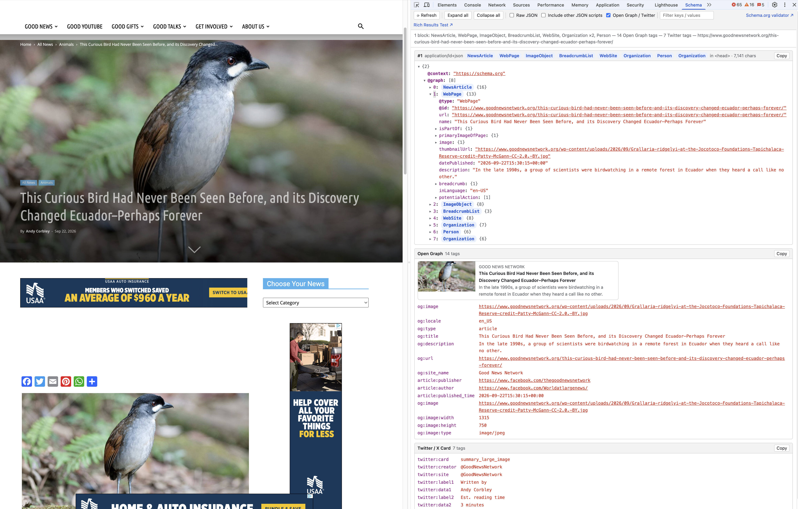

# Schema Viewer

> **Note:** This project was produced with the aid of AI tooling (Claude Code).

A Chrome DevTools extension that adds a **Schema** panel showing the page's
structured data (`<script type="application/ld+json">`).

## Install

1. Open `chrome://extensions`
2. Turn on **Developer mode** (top right)
3. Click **Load unpacked** and choose this folder
4. Open DevTools on any page → **Schema** tab (it may be under the `»` overflow)

## Features

- Collapsible tree view of every JSON-LD block, with `@type` badges
- Microdata (`itemscope` / `itemprop`) converted to the same JSON-LD-style tree
- Summary of all top-level types (including items inside `@graph`)
- Invalid JSON is flagged with the parser error and raw source
- Raw (pretty-printed) view, per-block copy, expand/collapse all
- Filter by key or value
- Open Graph (`og:*`, `article:*`, etc.) and Twitter card tags, with a link-preview card and warnings for missing required tags
- Robots meta tags and the `X-Robots-Tag` response header (`robots`, `googlebot`, `bingbot`, …) with blocking directives (`noindex`, `nofollow`, `none`) highlighted
  - The header is read from the original page load when DevTools was open at the time; otherwise the
    panel offers to reload the page or make a fresh `HEAD` request from the page to read it
- Canonical and `hreflang` alternates, flagging missing/multiple canonicals, a canonical pointing elsewhere, missing self-reference, and duplicate languages
- Optional: include other JSON script tags (`application/json`, etc.)
- Auto-rescans after navigation; **Refresh** picks up JSON-LD injected later by JS
- Links to the Schema.org validator and Google Rich Results Test for the current URL
- Follows the DevTools light/dark theme

Open `test.html` in Chrome to try it out (to use it with `file://` URLs, enable
"Allow access to file URLs" on the extension's details page).
After editing the source, click the reload icon on `chrome://extensions` and reopen DevTools.

## Screenshot

